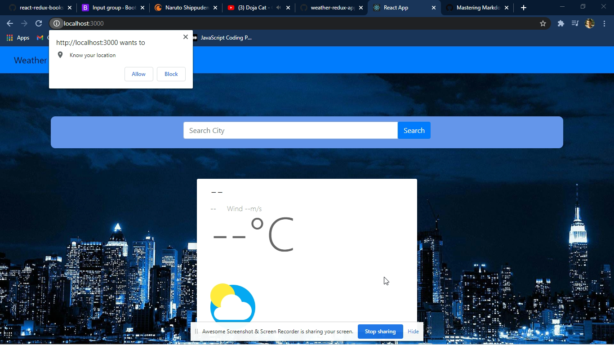
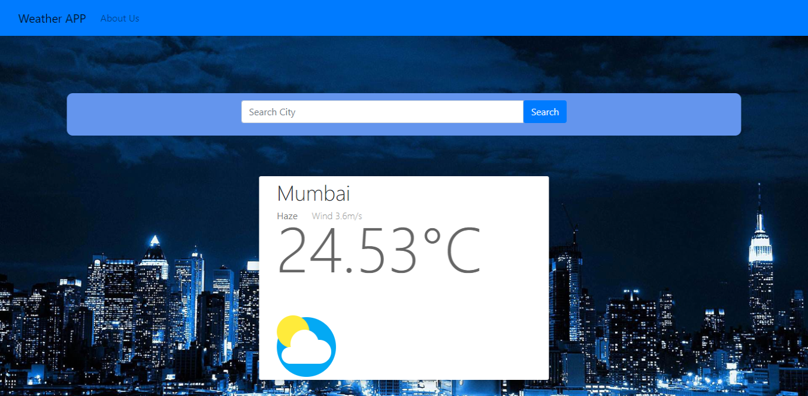
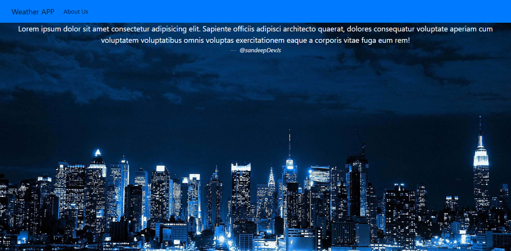
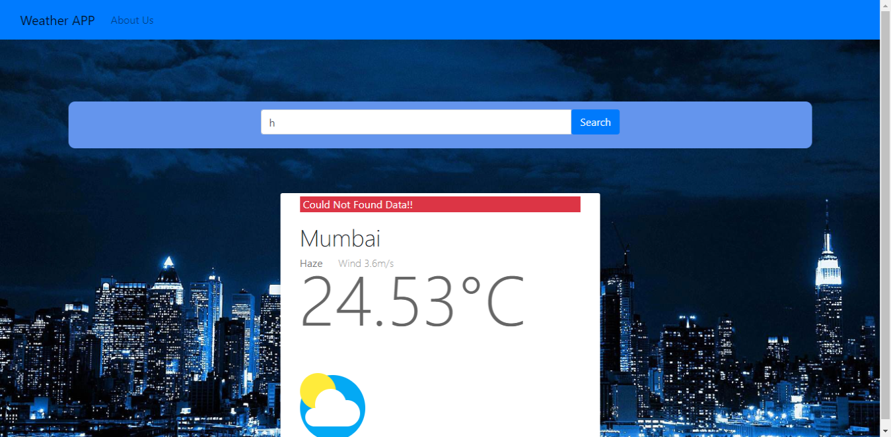

### About 

# This is a Weather app that tells about weather according to user's locations
# Weather Data is received using 'open Weather Map API'

### Packeges!
# App is Built Using 
    * React, 
    * Redux
    * React-redux, 
    * React-router-dom, 
    * redux-thunk, 
    * weather api, 
    * axios

### Get Started!!
# hit 'npm install'
# hit 'npm start!!'

### SnapShots!

# Geo Location Access

# Home

# Search City

# About Page

## Erro Handling

#  Geo Location Denied

# City Not Found
